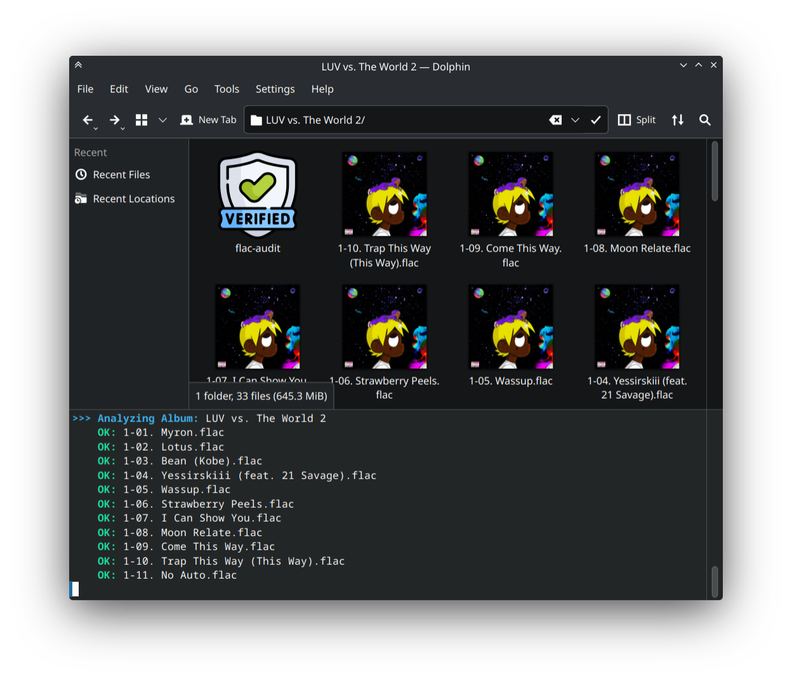
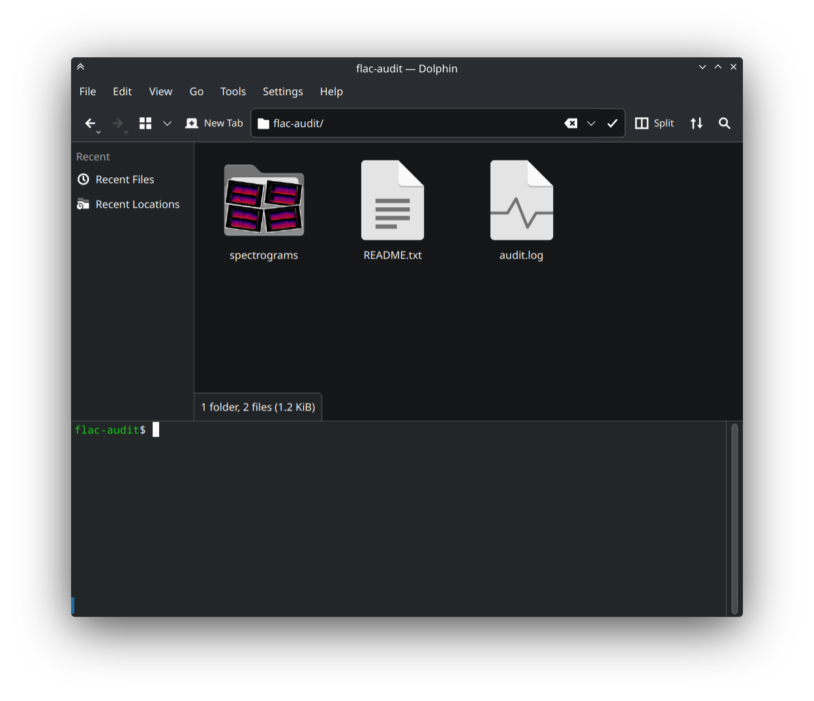
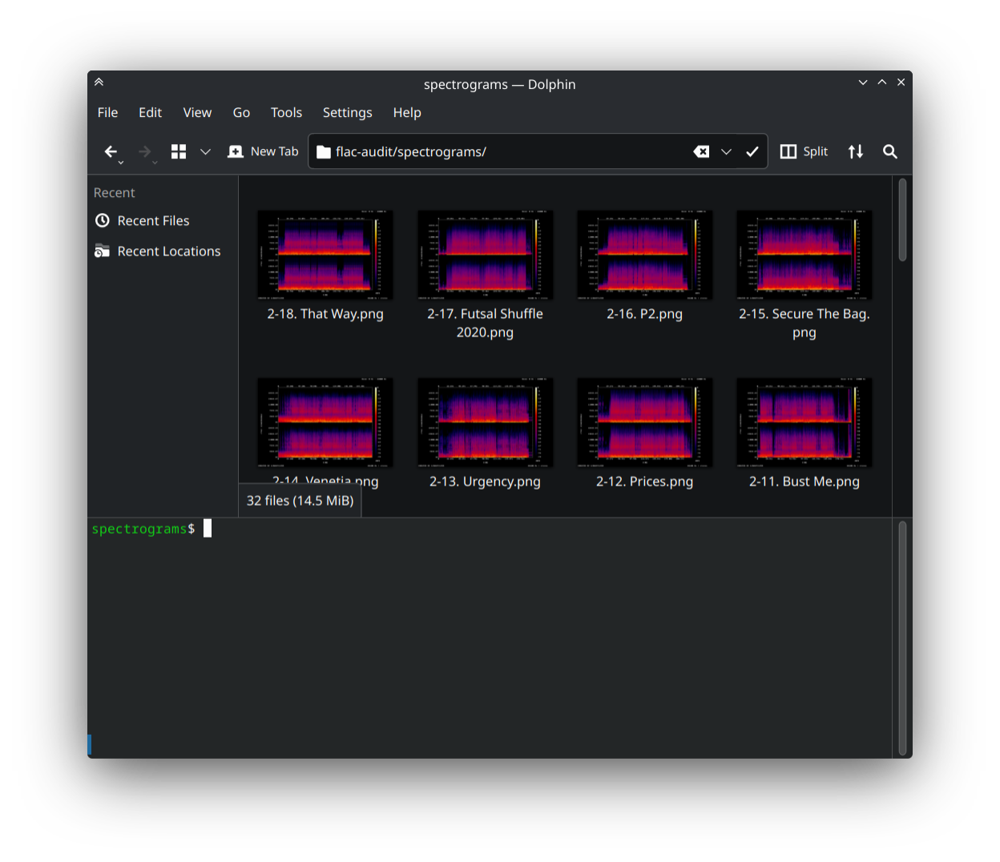
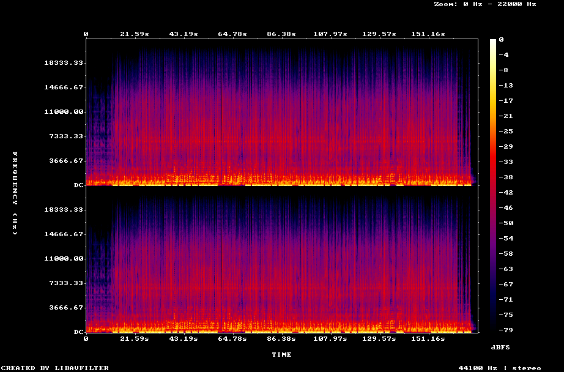

# FLAC Audit 🎵

A professional command-line tool to verify FLAC file integrity and generate high-fidelity spectrograms for audio analysis.

## Requirements

The script requires the following tools to be installed on your system:

* **`flac`** (for integrity checking)
* **`ffmpeg`** (for generating spectrograms)
* **`exiftool`** (for metadata management)

**System Packages:**
* **Fedora:** `sudo dnf install flac ffmpeg perl-Image-ExifTool`
* **Ubuntu/Debian:** `sudo apt update && sudo apt install flac ffmpeg libimage-exiftool-perl`
* **Arch/Manjaro:** `sudo pacman -S flac ffmpeg perl-image-exiftool`

## Installation

1. Clone this repository:
   ```bash
   git clone https://github.com/so3bre/flac-audit.git && cd flac-audit
   ```

2. To run the command from anywhere, add the directory to your PATH:

   ```bash
   echo "export PATH=\"\$PATH:$(pwd)\"" >> ~/.bashrc && source ~/.bashrc
   ```

   (For Zsh users, replace ~/.bashrc with ~/.zshrc)

## Setup

1. **Enable System Icons:**
   To enable system-wide icon branding, run the installation script:

   ```bash
   chmod +x install-icon.sh && ./install-icon.sh
   ```

2. **Configure:**
By default, icon branding is enabled (CREATE_DESKTOP_ICON=true). If you prefer to disable it, open flac-audit.sh and set CREATE_DESKTOP_ICON=false.

## Preview

Check out how FLAC-Audit visualizes your audio quality and organizes reports:

| Usage Demo | Audit Folder |
| :---: | :---: |
| [](assets/screenshots/usage-demo.png) | [](assets/screenshots/audit-folder.png) |

| Spectrograms Folder | Spectrogram Preview |
| :---: | :---: |
| [](assets/screenshots/spectrograms-folder.png) | [](assets/screenshots/spectrogram-preview.png) |

## Usage

After installation, you can run the audit tool in any directory:

```bash
flac-audit.sh
```

### Tips for convenience:
* **Don't want to type `.sh`?** Add this alias to your `~/.bashrc` or `~/.zshrc`:

   ```bash
   alias flac-audit='~/path/to/flac-audit/flac-audit.sh'
   ```

* **Running from a specific path:**
If you haven't added the script to your PATH, use the direct path:

   ```bash
   /path/to/flac-audit/flac-audit.sh
   ```

## Configuration

You can customize the script by editing the configuration block at the top of `flac-audit.sh`:

* **`CLEAN_METADATA=true`** — Automatically strips metadata from generated spectrograms.
* **`CREATE_DESKTOP_ICON=true`** — Enables automated folder branding (requires `install-icon.sh` to be run first).

## How it works

For every album folder, the script creates a dedicated `flac-audit/` directory containing:

* **`audit.log`** — A detailed record of the integrity check results.
* **`spectrograms/`** — High-quality visual frequency analysis generated via `ffmpeg`.
* **`README.txt`** — Documentation regarding the audit.
* **Branding** — Automatically applies a custom folder icon based on your configuration.

## Architecture

* **`flac-audit.sh`** — The primary script containing the logic for analysis, reporting, and icon management.
* **`install-icon.sh`** — Helper script to register the system icon.
* **`assets/`** — Contains the source icon used for branding.

### Credits

Thanks to Freepik & Flaticon for beautiful icon ([Verified icons created by Freepik - Flaticon](https://www.flaticon.com/free-icons/verified))

## License

MIT
